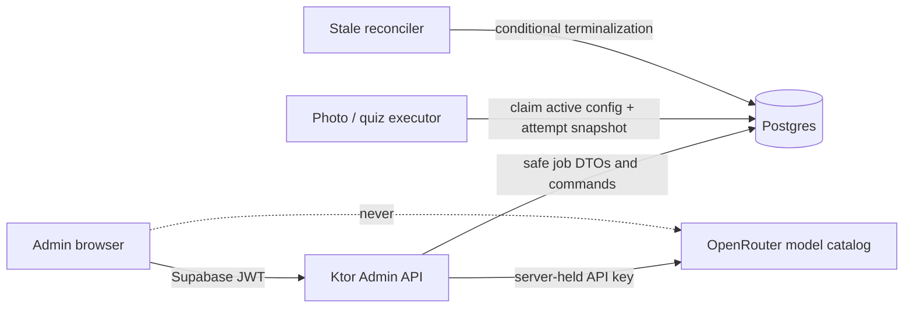

# Admin Control Plane — Jobs, Recovery, and Model Configuration

_A mobile-first operational surface for seeing every durable job, resolving stuck work,
rerunning failed work, and safely changing the models used by AI workloads_

---

## Status and visual contract

This document is the implementation contract for the Admin redesign. The mockups define the
visual hierarchy and mobile interaction pattern; this document defines behavior, data,
security, and acceptance criteria.

- [Jobs control panel](mockups/admin-jobs-control-panel.svg) — queue, job detail, recovery
  drawers, model configuration, and the OpenRouter-backed model picker.
- [Mobile Admin shell](mockups/admin-mobile-shell.svg) — Cost, Invites, bottom-sheet actions,
  and the same narrow application column at desktop widths.

If a visual detail conflicts with this document, the behavioral and security rules here are
authoritative.

---

## 1. Problem

The existing Admin page is a desktop-oriented tab layout and is not an operational control
plane:

- `frontend/src/pages/Admin.tsx` is one large component with desktop tables and a 1152 px
  content width.
- Its “System Operational” chip is static and cannot detect a broken dispatcher, stale work,
  or an invalid active model configuration.
- `GET /api/admin/jobs` reads only `quiz_generation_job`; photo analysis in `photo_session` is
  invisible.
- The frontend further filters the response down to failed quiz jobs, so pending, processing,
  done, and stale work is not inspectable.
- Retrying a quiz job mutates the same row back to `PENDING` and resets its attempts. This
  destroys the operational history needed to understand repeated failures.
- There is no Admin action to terminalize a stuck photo session, so `PROCESSING` can remain on
  the user's Home page indefinitely.
- OpenRouter model IDs are deployment environment variables. A missing role-specific variable
  can crash work after dispatch, while Admin has no way to see or validate the effective
  configuration.
- Admin dialogs use centered MUI `Dialog` components. The rest of the product is mobile-first,
  and focused Admin actions should use a reachable bottom drawer.

The permanent solution needs both automation and manual control. Stale work must normally be
terminalized by a reconciler; Admin is the fallback when infrastructure or a worker fails in
an unexpected way.

---

## 2. Decisions locked by this design

1. **The frontend never calls OpenRouter.** Browser requests end at authenticated
   `/api/admin/*` endpoints. Only backend/runtime code can read `OPENROUTER_API_KEY`.
2. **The model search catalog comes from OpenRouter through the backend.** The backend fetches
   and caches the account-visible catalog, applies workload filters, and returns a small safe
   DTO. OpenRouter supports model listing, search, and capability filters through its
   [Models API](https://openrouter.ai/docs/api/api-reference/models/get-models).
3. **All durable jobs are visible.** In the current architecture that means photo analysis
   (`photo_session`) and quiz generation (`quiz_generation_job`). Word discovery remains an
   inline operation, so it has a configurable model but does not appear as a queued job unless
   a future design makes it durable.
4. **Mark failed changes user-visible state immediately.** Terminalizing a photo analysis as
   `FAILED` removes the indefinite “Analysing” state from Home and exposes the existing failed
   scan recovery UI.
5. **Rerun creates a new attempt, not a new logical scan or a destructive reset.** The job keeps
   one stable identity; every execution attempt remains auditable.
6. **Model configuration is versioned.** Activation applies only to new attempts. Running
   attempts retain the model and configuration version they started with.
7. **Secrets are never editable in Admin.** Admin stores model identifiers and safe model
   metadata only. API keys, database credentials, and infrastructure secrets remain in secret
   management/environment configuration.
8. **Global status is binary.** The header says `Operational` or `System down`. It does not
   expose raw exceptions or provider responses.
9. **The Admin layout stays narrow at every viewport.** Desktop adds space around the same
   390–480 px application shell; it does not switch to wide tables or a second interaction
   model.
10. **Every transient Admin interaction uses a bottom drawer.** Confirmations, model selection,
    and invite creation must not use centered modal dialogs on mobile or desktop.

---

## 3. Scope

### Included

- Mobile-first Admin shell for Cost, Jobs, and Invites.
- Unified read model for photo-analysis and quiz-generation jobs.
- Status, type, age, attempt count, timestamps, safe failure category, user, and target summary.
- Filters for all, needs action, pending, processing, failed, and done.
- Job detail with attempt history.
- Conditional `Mark failed` and `Rerun` actions.
- Automatic stale reconciliation using the same terminalization service as Admin.
- Real system health derived from job/config/dispatcher state.
- Backend-mediated OpenRouter model catalog search.
- Versioned model configuration for photo analysis, quiz generation, and word discovery.
- Validation before activation and rollback by reactivating a previous valid version.
- Shared bottom-drawer component and visible enter/exit animation.
- Unit, integration, worker, and Playwright browser coverage.

### Not included

- Viewing or editing API keys in the browser.
- Displaying stack traces, raw provider errors, signed storage URLs, image content, prompts, or
  raw AI responses in Admin.
- Turning word discovery into a durable background job.
- Arbitrary replay with edited payloads.
- Bulk rerun without a bounded filter and explicit confirmation.
- WebSocket infrastructure. Jobs and Admin state can use TanStack Query polling plus
  focus/reconnect refresh; the control plane does not need push delivery to be correct.

---

## 4. System boundary



The backend base URL for OpenRouter is fixed in server configuration. Model identifiers from
the browser are treated as data and must never be interpolated into an arbitrary outbound URL.
The backend only selects an identifier returned by the cached catalog or resolves an exact,
properly encoded model slug against the fixed OpenRouter host.

---

## 5. Job model and recovery semantics

### 5.1 What “all jobs” means

The initial unified list contains the existing durable work sources:

| Admin type | Source of truth | Target | User-visible effect |
|------------|-----------------|--------|---------------------|
| `photo_analysis` | `photo_session` | Scan/photo | Drives Home and scan-detail status |
| `quiz_generation` | `quiz_generation_job` | Kanji/word | Produces quiz-bank content |

The repository reads the two typed Ktorm tables separately, maps them to one `AdminJobItem`,
merges them by `createdAt`, and applies a bounded limit. Do not introduce raw SQL strings or a
database view solely for the Admin list.

The DTO must include:

```text
id, type, status, stale, attempts, maxAttempts,
userId, summary, createdAt, updatedAt,
startedAt?, finishedAt?, failureCode?, modelId?, modelConfigVersion?
```

`summary` is bounded domain data such as `Photo analysis` or `Quiz generation · 駅`; it is not
a provider error message. Status values returned to the frontend are one lowercase union:
`pending | processing | done | failed`.

### 5.2 Attempt history

Add a shared `job_attempt` table:

```text
id uuid primary key
job_type text not null                 -- photo_analysis | quiz_generation
job_id uuid not null                   -- logical photo_session / quiz_generation_job id
attempt_number integer not null
status text not null                   -- pending | processing | done | failed
trigger text not null                  -- initial | platform_retry | admin_rerun | reconciler
model_config_version bigint
model_id text
failure_code text
started_at timestamptz
finished_at timestamptz
created_by text                        -- system or admin user id
created_at timestamptz not null
unique (job_type, job_id, attempt_number)
```

Keep `attempts` on the logical source tables as the fast aggregate used by existing code. The
attempt table is the history. A migration backfills one best-effort attempt for existing rows;
it must not invent precise start/finish times that were never recorded.

### 5.3 Mark failed

`POST /api/admin/jobs/{type}/{id}/fail`:

- accepts only `pending` or `processing` work;
- runs in a transaction;
- conditionally updates the logical row using its current status/`updated_at` so a concurrent
  successful completion wins rather than being overwritten;
- terminalizes the current attempt with bounded `failure_code=admin_stopped`;
- returns `409` when the job changed after the Admin loaded it; and
- returns the refreshed job DTO.

For photo analysis, this transition must immediately make `/api/photo/recent` and
`/api/photo/session/{id}` report `failed`. The frontend invalidates recent-scan queries so Home
stops showing “Analysing.”

### 5.4 Rerun

`POST /api/admin/jobs/{type}/{id}/rerun`:

- is allowed for `failed` work and stale active work;
- atomically terminalizes a stale current attempt before creating the next attempt;
- increments the attempt number instead of resetting it;
- records `trigger=admin_rerun` and the authenticated Admin user;
- snapshots the currently active model configuration and model ID;
- returns `409` if another caller already reran or completed the job; and
- invokes the existing durable dispatcher only after the transaction commits.

Photo rerun must use `storage_path` and obtain a fresh storage URL/server-side object access.
It must never reuse the expired signed URL stored in `image_url`. If the stored object no
longer exists, the rerun is rejected with a bounded `source_missing` result and the scan stays
failed.

The logical `photo_session` ID stays stable so existing `/scans/{sessionId}` links continue to
work. The attempt history shows the failed run and the new run.

### 5.5 Automatic stale reconciliation

Manual recovery is not the primary timeout mechanism. A scheduled reconciler uses the same
conditional service method to mark abandoned active attempts failed. Thresholds are
configuration, not UI constants, and may differ by job type. Admin labels a row stale when
the server says `stale=true`; the browser must not calculate authority from its own clock.

---

## 6. Model catalog and configuration

### 6.1 Catalog search flow

The model drawer is labelled **Search OpenRouter models**.

1. Opening the drawer calls `GET /api/admin/models?workload=photo_analysis` for the cached
   workload-compatible list and current selection.
2. After the user types, the frontend waits for at least two non-space characters and
   debounces `q` updates by 300 ms.
3. TanStack Query uses `['admin-models', workload, query]`; an obsolete request is cancelled
   when the query changes.
4. The backend fetches OpenRouter's account-filtered
   [`GET /api/v1/models/user`](https://openrouter.ai/docs/api/api-reference/models/list-models-user)
   catalog with the server-held key and caches it for ten minutes. Searches filter the cached
   catalog in memory; typing does not create one OpenRouter request per keypress.
5. Workload filtering is enforced again on the backend:
   - photo analysis requires image input and text output;
   - quiz generation and word discovery require text input and text output; and
   - validation checks the response/structured-output features used by the actual client.
6. The response exposes only safe fields:

```text
id, canonicalSlug, name, inputModalities, outputModalities,
contextLength, supportedParameters, promptPrice, completionPrice
```

The frontend does not receive OpenRouter response headers, account information, provider
credentials, or the raw catalog response. Catalog errors return a bounded
`catalog_unavailable` code. The drawer keeps the current selection and offers Retry.

### 6.2 Versioned configuration

Add `ai_model_config`:

```text
version bigint generated always as identity primary key
status text not null                   -- draft | active | superseded | rejected
photo_analysis_model text not null
quiz_generation_model text not null
word_discovery_model text not null
validation_status text not null        -- pending | passed | failed
failure_code text
created_by text not null
created_at timestamptz not null
validated_at timestamptz
activated_at timestamptz
```

Enforce at most one `active` row with a partial unique index. Activation supersedes the old
row and activates the new row in one transaction. Previous versions remain available for
audit and rollback.

The source precedence is:

1. active database configuration;
2. existing `OPENROUTER_ANALYZE_MODEL`, `OPENROUTER_QUIZ_MODEL`,
   `OPENROUTER_DISCOVERY_MODEL`, or `OPENROUTER_MODEL` only as bootstrap fallback; and
3. no complete configuration means `System down` and no new job dispatch.

`OPENROUTER_API_KEY`, site URL, app name, timeout, and other secrets/runtime controls remain
environment configuration.

### 6.3 Validation and activation

`POST /api/admin/model-config/validate` creates or updates a draft and validates all three
models. Validation includes:

- exact catalog presence for the current OpenRouter account;
- required input/output modalities and parameters;
- a bounded, low-token smoke request for each workload contract, including a tiny static image
  fixture for photo analysis; and
- parse validation using the same structured-response parser as production.

`POST /api/admin/model-config/{version}/activate` succeeds only for the latest draft with
`validation_status=passed`. A failed draft does not replace the healthy active version and
does not make global status down. If the active configuration is missing or production health
checks show the active pipeline cannot start, global status becomes `System down`.

Every new `job_attempt` snapshots `model_config_version` and `model_id`; in-flight attempts do
not switch models when a new configuration activates.

---

## 7. Operational status

Add `GET /api/admin/status`. Its public Admin response is intentionally small:

```json
{
  "status": "operational",
  "checkedAt": "2026-08-05T12:00:00Z"
}
```

The only status values are `operational` and `down`. The backend may log bounded internal
reason codes, but the Admin header does not render them.

Status is down when any required invariant fails, including:

- no complete active/bootstrap model configuration;
- the durable dispatcher/executor is unavailable;
- the stale reconciler has stopped advancing its heartbeat;
- the oldest active job exceeds the hard stale threshold without terminalization; or
- database access required to inspect/control jobs fails.

A normal failed job does not by itself mean the whole system is down. Repeated failures or an
unreconciled stale job can trip the operational check.

---

## 8. Frontend implementation

### 8.1 Component structure

Keep `frontend/src/pages/Admin.tsx` as the lazy route entry and extract focused code under
`frontend/src/pages/admin/`:

```text
AdminShell.tsx
CostTab.tsx
JobsTab.tsx
JobCard.tsx
JobDetail.tsx
JobActionDrawer.tsx
ModelSettings.tsx
ModelPickerDrawer.tsx
InvitesTab.tsx
InviteDrawer.tsx
AdminBottomDrawer.tsx
api.ts
types.ts
```

All GET data uses TanStack Query. Mutations invalidate `admin-status`, `admin-jobs`, the
affected job detail, and—when a photo changes—`recent-scans`/photo-session queries.

The route shell uses `width: 100%`, `maxWidth: 480`, and `minHeight: var(--app-height)` with
the bottom navigation contained inside that column. Desktop centers the same shell.

### 8.2 Shared bottom drawer

Replace Admin's centered MUI `Dialog` usage with one shared `AdminBottomDrawer` built on the
already-installed MUI `SwipeableDrawer` with `anchor="bottom"` and `disableSwipeToOpen`.
No new animation library is required.

The drawer contract:

- paper width is `min(100vw, 480px)` and centered even when the portal/backdrop fills desktop;
- top corners are rounded; the bottom edge meets the visual viewport;
- content accounts for `env(safe-area-inset-bottom)`;
- the opening trigger retains focus and regains it after dismissal;
- Escape, backdrop tap, explicit Cancel, and downward swipe dismiss when the action is not
  submitting;
- destructive submission disables dismissal until the server resolves or fails visibly;
- focus is trapped while open and the drawer is labelled with `aria-labelledby`;
- animation uses only `transform` and backdrop `opacity`; never animate `top` or `height`; and
- `prefers-reduced-motion: reduce` is honored as an accessibility exception.

### 8.3 Motion timing — explicit acceptance contract

The drawer must visibly travel in and out. It must not appear/disappear in a single frame.

| Transition | Duration | Easing | Start/end |
|------------|----------|--------|-----------|
| Enter | **300 ms** | `cubic-bezier(0.16, 1, 0.3, 1)` | `translateY(100%)` → `translateY(0)` |
| Exit | **260 ms** | `cubic-bezier(0.4, 0, 1, 1)` | `translateY(0)` → `translateY(100%)` |
| Backdrop enter | 220 ms | ease-out | opacity 0 → target |
| Backdrop exit | 200 ms | ease-in | target → opacity 0 |

The drawer remains mounted until its exit transition finishes. These timings apply with
`prefers-reduced-motion: no-preference`; reduced-motion users receive an immediate or greatly
shortened transition.

### 8.4 UI states

Every Admin query has a layout-shaped loading state, an explicit empty state, and an inline
retryable error. Model search shows idle, searching, results, no results, and catalog
unavailable without dismissing the drawer. Job mutation errors leave the drawer open and
refresh the job when a `409` reports concurrent change.

---

## 9. Backend and worker code changes

### Existing files to change

| File/area | Change |
|-----------|--------|
| `backend/.../core/db/Tables.kt` | Add `JobAttemptTable` and `AiModelConfigTable`; map new columns/enums |
| `backend/.../modules/admin/AdminModels.kt` | Replace quiz-only job DTO with typed unified jobs, attempts, status, model catalog/config DTOs |
| `backend/.../modules/admin/AdminRepository.kt` | Read photo + quiz jobs, merge/sort, query attempts/config versions; remove destructive retry reset |
| `backend/.../modules/admin/AdminService.kt` | Add conditional fail/rerun, health, catalog search, validate/activate orchestration |
| `backend/.../modules/admin/AdminRoutes.kt` | Add status, unified filters/detail/actions, models, and model-config endpoints |
| `backend/.../Application.kt` | Wire catalog/config/job-control dependencies and server-held OpenRouter configuration |
| `backend/.../core/plugins/Routing.kt` | Pass the expanded Admin service without crossing module boundaries |
| `services/ai-worker/app/ai_client.py` | Build clients from an explicit effective configuration rather than role models read only from env |
| `services/ai-worker/app/openrouter.py` | Accept snapshotted model IDs; retain API key and runtime options from env |
| `services/ai-worker/app/db.py` | Claim/finish attempts and load active configuration transactionally |
| `services/ai-worker/app/photo_job.py` | Use fresh storage access and the attempt's model snapshot; terminalize uncaught startup/config failures |
| quiz-generation worker routes | Use attempt records and snapshotted quiz model |
| `Makefile`, `.env.example`, deploy config | Keep API key/runtime secrets; document role-model env values as bootstrap fallback, not live source of truth |
| `frontend/src/pages/Admin.tsx` | Split into mobile components, Query hooks, real status, unified jobs, models, and drawers |
| `frontend/playwright.config.js` | Add mobile Chromium, Firefox, and WebKit projects for Admin interaction coverage |
| `frontend/tests/e2e/fake-api.mjs` | Add Admin job/status/catalog/config fixtures and deterministic mutation controls |

### New files/areas

- `supabase/migrations/<timestamp>_admin_control_plane.sql`
- `backend/src/main/kotlin/com/kanjimasta/core/ai/OpenRouterCatalogClient.kt`
- `backend/src/main/kotlin/com/kanjimasta/core/ai/AiModelConfigRepository.kt`
- `backend/src/main/kotlin/com/kanjimasta/core/jobs/JobControlService.kt`
- frontend Admin components listed in section 8.1
- `frontend/src/pages/admin/__tests__/...`
- `frontend/tests/e2e/admin-control-plane.spec.js`

The shared model-config and job-control code belongs under `core/` because application modules
must not import each other. The later Kotlin consolidation replaces the Python consumers with
Kotlin consumers of the same tables and contracts; it must not require a second Admin API or
schema redesign.

---

## 10. Blast radius and risk controls

| Area | Blast radius | Primary control |
|------|--------------|-----------------|
| User Home/scan status | Mark failed changes an active scan immediately | Conditional update, query invalidation, integration test |
| Job execution | Rerun can duplicate provider calls | Unique attempt number, transactional claim, idempotent terminal writes |
| Stored photos | Old signed URLs may be expired | Rerun uses `storage_path` and fresh server-side access |
| Quiz generation | Existing retry resets history | Migrate to attempt history before enabling new UI |
| Model behavior | Bad model could break every new job of a role | Draft validation, smoke requests, atomic activation, rollback version |
| Existing running work | Activation during execution | Model/version snapshot per attempt |
| OpenRouter account | Search/validation adds API traffic | Backend cache, debounce, fixed host, bounded timeout |
| Credentials | Catalog requires API key | Backend-only call; response/log redaction; no key in frontend bundle |
| Database | New attempt/config tables and concurrent mutations | Expand-first migration, constraints, Testcontainers concurrency tests |
| Operational status | False down/healthy status | Server-calculated invariants and reconciler heartbeat tests |
| Admin UI | Large monolith refactor | Extract tab by tab; preserve API route and auth gate |
| Mobile UX | Drawer can feel instantaneous or get stuck | Explicit motion contract and real browser animation tests |
| Accessibility | Motion/focus can block operation | Focus restoration, Escape/backdrop, reduced motion, keyboard tests |
| Platform migration | Python and Kotlin could interpret config differently | One DB contract and parity tests before retiring Python |

Rollout must preserve the existing active model configuration. Do not deploy a schema or
consumer that requires a database config row before the bootstrap fallback is available.

---

## 11. Test plan

### 11.1 Backend unit and integration tests

Add coverage to `AdminIntegrationTest` and focused service tests for:

- non-admin receives `403` from every new endpoint;
- unified list contains photo and quiz jobs in descending time order;
- type/status/needs-action filters and counts cover both tables;
- stale is calculated server-side from the correct threshold;
- job detail returns attempt history but not raw provider response/image URL;
- mark-failed terminalizes pending/processing photo and quiz work;
- marking a completed job returns `409` and does not overwrite success;
- concurrent completion versus mark-failed has one terminal winner;
- rerun of failed/stale work appends the next attempt and never resets history;
- duplicate rerun requests create only one next attempt;
- photo rerun uses `storage_path`, obtains fresh access, and rejects a missing object;
- active config is unique and activation supersedes the previous version atomically;
- failed validation leaves the old active version unchanged;
- new attempts snapshot the active version/model;
- catalog endpoint filters by workload and returns only the safe DTO;
- OpenRouter timeout/401/5xx maps to bounded Admin errors without leaking response bodies;
- catalog cache prevents one provider request per frontend query; and
- status reports down/operational for every defined invariant.

Use Ktor `MockEngine` for OpenRouter catalog and smoke-validation responses. Use
Testcontainers for transaction, uniqueness, and concurrent claim behavior.

### 11.2 Worker tests

During the current Python-worker phase, add tests for:

- complete active DB config overrides bootstrap model environment variables;
- no DB config falls back to the existing complete environment configuration;
- incomplete DB and environment configuration fails before provider work and terminalizes the
  claimed attempt;
- photo/quiz/discovery select the correct role model;
- a running attempt keeps its snapshotted model after activation of a new version;
- uncaught startup/config/provider failures always write a terminal attempt/job result;
- a duplicate execution cannot claim the same attempt; and
- photo rerun obtains fresh storage access rather than using `image_url`.

Equivalent Kotlin tests become a gate for removing the Python worker.

### 11.3 Frontend unit tests

Add Vitest/Testing Library coverage for:

- the Admin page uses real `/api/admin/status` data rather than a static chip;
- all job statuses/types render and filters update the query key;
- mark-failed/rerun drawers show the exact affected job and mutation state;
- `409` keeps the drawer open, refreshes data, and explains that the job changed;
- model input is labelled `Search OpenRouter models`;
- input shorter than two characters does not fetch;
- search is debounced and obsolete requests are cancelled;
- catalog loading, empty, error, retry, and result states remain in the drawer;
- selecting a model updates only the draft;
- activation invalidates status/config/job queries;
- no frontend module contains an OpenRouter URL or imports/reads `OPENROUTER_API_KEY`;
- all Admin transient actions render through `AdminBottomDrawer`, not MUI `Dialog`;
- Escape/backdrop/Cancel restore focus; and
- reduced-motion preference is honored.

### 11.4 Playwright browser tests — drawer motion is mandatory

Add `frontend/tests/e2e/admin-control-plane.spec.js` and run it as mobile Chromium, Firefox,
and WebKit. The existing Playwright configuration is Firefox-only; expand it into projects
while retaining the current fake API and mobile viewport approach.

The animation test must run with `prefers-reduced-motion: no-preference`. Do not disable CSS
transitions or globally force duration to zero in E2E setup.

For every drawer category—job confirmation, model picker, and invite creation—test:

1. Tap the trigger and assert the drawer is mounted near `translateY(100%)` at the start.
2. Sample its bounding box/computed transform after approximately 80–120 ms and assert it is
   strictly between the closed and final positions. This proves the entrance is visible to a
   human rather than completing in one frame.
3. After at least 300 ms, assert it reaches the open position and remains usable.
4. Dismiss by explicit Cancel/backdrop; separately cover Escape and downward swipe where the
   browser engine supports the gesture.
5. During the first 80–120 ms of dismissal, assert the drawer remains mounted and has moved to
   an intermediate position.
6. After at least 260 ms, assert it is off-screen/unmounted and focus returned to the trigger.
7. Assert the computed enter duration is 300 ms and exit duration is 260 ms, allowing only a
   small browser rounding tolerance.

Also cover:

- the drawer paper never exceeds 480 px on a desktop viewport;
- safe-area padding and 44 px minimum action targets at mobile width;
- model search requests go only to the fake Admin API—fail the test if the page requests any
  `openrouter.ai` URL;
- search results are workload-filtered and selecting one updates the draft;
- a catalog error remains actionable without closing the drawer;
- mark failed removes the active photo from the processing state after refresh;
- rerun creates the next attempt and preserves the previous attempt in detail; and
- the reduced-motion test may skip intermediate-frame assertions but must remain functional.

Browser automation provides engine-level Chromium/Firefox/WebKit confidence. Before release,
perform one real-device drawer smoke test on the supported phones/browsers because mobile
browser chrome, safe areas, and swipe physics are not fully reproduced by desktop engines.

---

## 12. Implementation sequence

### Phase 1 — Expand schema and preserve history

1. Add `job_attempt` and `ai_model_config` with constraints and Ktorm mappings.
2. Backfill best-effort attempt rows for existing photo and quiz records.
3. Keep environment model configuration as bootstrap fallback.
4. Deploy readers before enabling Admin mutations.

### Phase 2 — Job observability and recovery

1. Build the unified Admin read model and real status endpoint.
2. Add shared conditional mark-failed/reconciler behavior.
3. Add rerun with attempt history and fresh photo storage access.
4. Ship backend/worker tests and verify the original stuck-photo scenario.

### Phase 3 — Model catalog and versioned configuration

1. Add backend-only OpenRouter catalog client and cache.
2. Add draft validation, smoke requests, activation, and rollback.
3. Change Python worker client creation to consume attempt snapshots.
4. Prove parity before the later Kotlin consumer replaces it.

### Phase 4 — Mobile Admin frontend

1. Extract the narrow Admin shell and bottom navigation.
2. Convert Cost/Jobs/Invites tables to stacked mobile cards.
3. Add Jobs queue/detail/models views using TanStack Query.
4. Replace every Admin `Dialog` with the shared animated bottom drawer.
5. Add unit and multi-engine Playwright coverage, including intermediate animation frames.

### Phase 5 — Rollout

1. Deploy schema, backend, and worker before the new frontend controls.
2. Bootstrap/validate the current model IDs as configuration version 1.
3. Force one failed photo and quiz job, then mark failed/rerun through Admin.
4. Activate a test model version, verify new attempts snapshot it, then roll back.
5. Complete real-device drawer tests and observe status/reconciler metrics for 24 hours.

---

## 13. Definition of done

- [ ] Admin lists every durable photo-analysis and quiz-generation job and all four statuses.
- [ ] Stale jobs are automatically terminalized, and Admin can manually mark failed.
- [ ] A failed photo no longer stays “Analysing” on Home.
- [ ] Rerun appends an auditable attempt and never depends on an expired signed image URL.
- [ ] The system status is real and binary, with no raw error details in the header.
- [ ] The browser never contacts OpenRouter and never receives its API key.
- [ ] Model search uses the backend catalog proxy and workload capability filters.
- [ ] Model validation/activation is versioned, atomic, reversible, and applies only to new
  attempts.
- [ ] Word discovery is configurable but is not misrepresented as a durable job.
- [ ] Admin uses the same mobile-width shell on phones and desktop.
- [ ] Every transient Admin interaction is a bottom drawer.
- [ ] Drawer entrance and dismissal are visibly animated at the locked timings in Chromium,
  Firefox, and WebKit with intermediate-frame assertions.
- [ ] Reduced-motion users can complete every action.
- [ ] Backend, worker, frontend unit, integration, and browser suites pass.
