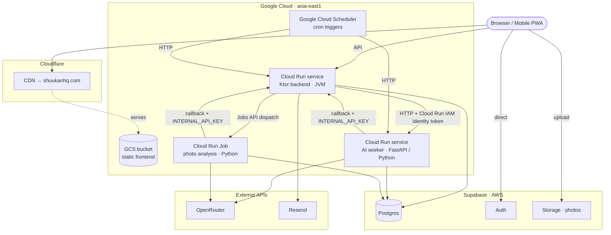
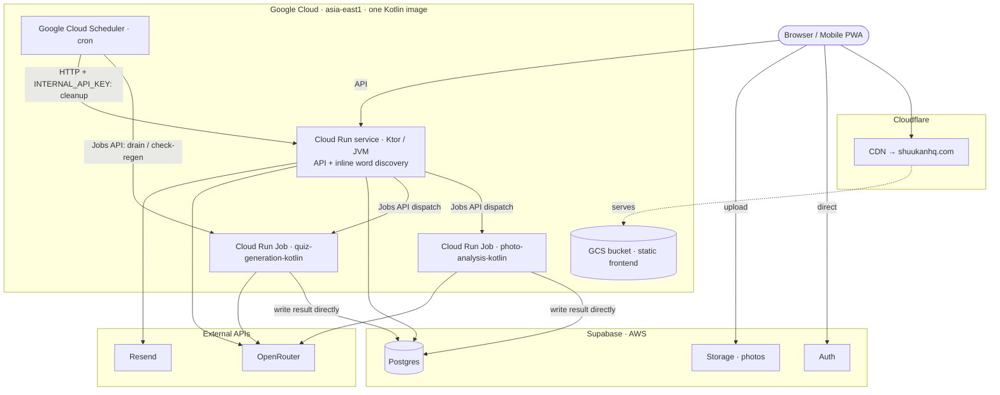
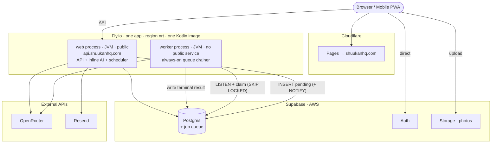

# Infrastructure Migration — Consolidate to Kotlin, then move to Fly.io + Cloudflare Pages

_Fold the Python AI worker into the Kotlin/Ktor codebase (Milestone 1), then optionally move
the runtime from Cloud Run + GCS to Fly.io + Cloudflare Pages (Milestone 2). Supabase remains
the database, auth, and storage provider throughout._

> **Implementation status (2026-08-06):** Milestone 1 code consolidation is implemented in
> the working tree: the Python worker source/build targets are removed, the Kotlin launcher
> and direct-write executors exist, the reliability migration is added, and the full Kotlin
> test suite, fat-JAR build, and frontend build pass. The Definition of Done remains unchecked until the
> migration is applied, the new Cloud Run Jobs and backend revision are deployed, scheduler
> targets are cut over, and the production soak and rollback drill complete.

---

## 0. Two independent milestones

This document describes **two milestones that ship and stand on their own.** Do not treat the
first as merely a stepping stone to the second.

- **Milestone 1 — Kotlin consolidation (on Cloud Run).** Delete the Python worker; run one
  Kotlin image as a Cloud Run **service** (API + inline AI) plus Kotlin Cloud Run **Jobs**
  (photo analysis, quiz generation) that write results directly to Postgres. This is a
  **complete, durable, indefinitely-livable architecture.** It fixes the two-language /
  two-database-layer problem that motivates the whole effort, and **feature work proceeds on
  it** with no dependency on Milestone 2. If Milestone 2 never happens, Milestone 1 is still a
  strictly better place to be than today.

- **Milestone 2 — Fly.io + Cloudflare Pages (optional, later).** Replace the Cloud Run Jobs
  with an always-on in-process **queue drainer**, replace Google Cloud Scheduler with an
  in-process scheduler, and move the runtime to Fly.io + Cloudflare Pages. This changes only
  the *runtime platform* and the *durable-execution mechanism* — the Kotlin code, the AI
  clients, the durable database records, and the direct-write result handling all carry over
  unchanged from Milestone 1.

The single most important sequencing decision is already made: **Milestone 1 is a resting
state, not a transition.** The Kotlin Cloud Run Jobs it introduces are the durable-execution
model until and unless Milestone 2 is undertaken.

---

## 1. Why consolidate (motivation)

This migration begins with a language consolidation, and the consolidation carries the
justification. Do it first; the platform move is smaller and cleaner once there is one
application instead of two.

**1. Remove a second language and a duplicated database layer.** The retired AI worker's
`services/ai-worker/app/db.py` was ~636 lines that re-implemented, in psycopg2, database
access the Ktor backend already expresses in Ktorm
against the *same* Supabase tables. Today every schema change is applied in two places, in
two languages, with two connection-pool implementations, two Docker images, and two deploy
targets, plus a
backend↔worker authentication handshake and result callbacks between them. Consolidating to
one Kotlin codebase deletes all of that surface. This is the primary reason and it needs no
qualification.

**2. Move a large class of schema errors from production to the compiler — with one honest
caveat.** In the Python worker, a mistyped column in a SQL string or a wrong key on a result
row is a *runtime* error, often a production one. In Ktorm those are typed properties on
`Table` objects: column typos, type mismatches, nullability, and rename-refactors are caught
by the compiler and IDE before anything runs. That is the class of error that actually
recurs, and it is the daily inner-loop win.

The honest caveat: Ktorm does **not** verify at compile time that your declared `Table`
objects match the *actual* Postgres schema. A migration that adds a column the code doesn't
declare, or a declared type that disagrees with the database, surfaces at query execution —
caught by the Testcontainers integration tests, exactly as today. So the accurate claim is:
consolidation collapses **two hand-maintained schema mappings into one and puts the compiler
in front of the survivor**; the mapping-vs-real-database check stays where it already lives,
in the integration suite that both stacks already run.

**3. Developer velocity.** A single Kotlin codebase with one build, one test command, and one
mental model is faster and more pleasant to work in than a Kotlin/Python split. This is a
tiebreaker, not the load-bearing reason, but it is why this is worth doing now rather than
never.

**What consolidation costs.** The worker has no Python-specific capability that blocks a port,
but the move is still a meaningful application rewrite. Its runtime is conventional HTTP,
Postgres, JSON validation, prompts, and image bytes → base64 → data URL. The AI call is an
OpenRouter JSON POST, and gpipi provides a Kotlin reference (`OpenRouterClient`, strict-JSON
structured extraction). Prompts become Kotlin constants; pydantic models become data classes;
and the worker queries become Ktorm. The material work is preserving claim/retry semantics,
transactional result application, cost accounting, and the existing test contract.

**Drop Gemini during the port.** The provider abstraction and the `gemini.py` /
`google-genai` path are retired rather than ported — OpenRouter is now the only AI provider in
use, including for photo-analysis vision (`openrouter.py` already carries the image
`analyze_image` path). This removes the `google-genai` dependency and the one Kotlin-side
inconvenience the two-provider design would have created (Gemini has no official Kotlin SDK).
The result is a single `OpenRouterClient` with no `AI_PROVIDER` switch. Re-adding a second
provider later is a small, isolated change if it is ever wanted.

---

## 2. Objective

Migrate the application runtime and topology without moving application data:

- Fold the Python AI worker into the Kotlin/Ktor codebase as **inline services** (for
  interactive work) plus an **always-on queue drainer** (for durable background work).
- Replace the Cloud Run photo-analysis **Job** and the worker's synchronous AI HTTP
  endpoints with a Postgres-backed job queue drained by the always-on worker process.
- Replace Google Cloud Scheduler with an **in-process Ktor scheduler that enqueues** work.
- Deploy the single Kotlin image to **one Fly.io app with two process groups** (`web` and
  `worker`).
- Host the React/Vite frontend on **Cloudflare Pages**.
- Keep **Supabase** as PostgreSQL, auth, and photo storage.
- Preserve the `shuukanhq.com` frontend domain; introduce `api.shuukanhq.com` as the stable
  API hostname.
- Retire Cloud Run, Cloud Run Jobs, GCS frontend hosting, and Google Cloud Scheduler.
- Provide a staged cutover with a DNS-based rollback path.

No production-data move is required. Milestone 1 does require a small **additive, backward-
compatible schema migration** for claim fencing and result idempotency. The durable source
rows — `photo_session` and `quiz_generation_job` — remain in place; new lease/claim metadata,
result identity, and cost uniqueness make their execution safe to retry. Milestone 2 later
reuses and generalizes those primitives rather than introducing a second queue schema.

---

## 3. Architecture: before, after Milestone 1, after Milestone 2

Three states, because you will live on the middle one indefinitely.

### 3.1 Before — current production (Cloud Run + Python)



### 3.2 After Milestone 1 — consolidated Kotlin on Cloud Run (the resting state)

This is where feature work happens. One Kotlin image runs as a Cloud Run service plus Kotlin
Cloud Run Jobs. The separate Python worker service is gone; the Jobs write results directly to
Postgres through shared Ktorm code, so there are no worker result callbacks. The existing
`INTERNAL_API_KEY` remains temporarily only for the Cloud Scheduler → stale-cleanup endpoint;
it is not used by either Kotlin Job. The platform is still Google Cloud.



### 3.3 After Milestone 2 — Fly.io + Cloudflare Pages



### 3.4 Component inventory

| Concern | Before (Python, Cloud Run) | After Milestone 1 (Kotlin, Cloud Run) | After Milestone 2 (Kotlin, Fly) |
|---|---|---|---|
| Static frontend | GCS bucket (GCP) | GCS bucket (GCP) | Cloudflare Pages |
| CDN / DNS | Cloudflare CDN | Cloudflare CDN | Cloudflare |
| API backend | Cloud Run service · Ktor/JVM | Cloud Run service · Ktor/JVM | Fly `web` process · Ktor/JVM |
| Inline AI (word discovery) | Cloud Run worker · Python | Cloud Run service · inline Kotlin | Fly `web` process · inline Kotlin |
| Durable photo analysis | Cloud Run **Job** · Python | Cloud Run **Job** · Kotlin | Fly `worker` · drainer (Kotlin) |
| Quiz generation | Cloud Run worker · Python | Cloud Run **Job** · Kotlin | Fly `worker` · drainer (Kotlin) |
| Cron scheduling | Google Cloud Scheduler | Google Cloud Scheduler | in-process Ktor scheduler |
| Database / Auth / Storage | Supabase | Supabase | Supabase |
| AI provider | Gemini / OpenRouter | OpenRouter (Kotlin) | OpenRouter (Kotlin) |
| Email | Resend | Resend | Resend |

**What Milestone 1 changes (the move you actually live on):**

- Languages: **2 → 1** (Python deleted; Kotlin only).
- Database-access layers: **2 → 1** (Ktorm only; psycopg2 removed).
- Container images: **2 → 1** (one Kotlin image runs the service and both Jobs via different
  entrypoints).
- Runtime deployables: **2 Cloud Run services + 1 Job → 1 Cloud Run service + 2 Jobs**, all
  from that one image; the separate worker service is gone.
- Worker coordination: the Cloud Run IAM identity token used for backend→worker HTTP and the
  `INTERNAL_API_KEY` used for worker→backend result callbacks are removed from those paths.
  `INTERNAL_API_KEY` remains temporarily only on the existing scheduled cleanup endpoint and
  is removed with Google Cloud Scheduler in Milestone 2. There is no `WORKER_API_KEY` in the
  current implementation.
- AI provider: **two-provider (Gemini / OpenRouter) → OpenRouter only**; the `google-genai`
  dependency and the `AI_PROVIDER` switch are removed.
- Cloud provider: **still Google Cloud.** Nothing about the platform changes yet.

**What Milestone 2 adds on top (optional, later):**

- Durable execution: **Cloud Run Jobs → one always-on `worker` process draining a queue.**
- Cron: **Google Cloud Scheduler → in-process Ktor scheduler (enqueuer).**
- Frontend host: **GCS → Cloudflare Pages.**
- Compute topology: **1 Cloud Run service + 2 Jobs → 1 Fly app with 2 process groups.**
- Cloud provider: **Google Cloud removed entirely** (runtime path becomes Cloudflare + Fly +
  Supabase).

### 3.5 Durable vs inline — the split that holds across both milestones

The division of labour is the same in both milestones; only the *mechanism* for durable work
changes (Cloud Run Job in Milestone 1, queue drainer in Milestone 2). Fast, interactive,
user-is-waiting work stays a direct in-process call on the backend either way — routing it
through a job or queue would only add latency for no durability benefit.

| Work | Nature | Placement | Milestone 1 mechanism | Milestone 2 mechanism |
|---|---|---|---|---|
| Photo analysis | slow, durable, user locks the phone | durable | Kotlin Cloud Run Job | drainer |
| Quiz generation | backed by a durable `quiz_generation_job` row; batch/cron | durable | Kotlin Cloud Run Job | drainer |
| Word discovery | interactive capability | inline | Kotlin service in the API codebase | inline on `web` |
| Cron (generate quizzes, check-regen, cleanup) | scheduled | trigger | Cloud Scheduler → dispatch Job | scheduler → enqueue |

Milestone 1 ports word discovery into Kotlin and keeps its database-backed model selection.
The service remains callable from Kotlin application code, but the migration does **not**
introduce a new automatic product trigger. Wiring discovery into manual kanji addition or a
new public endpoint is a separate feature change.

### 3.6 Milestone 1 fixed implementation decisions

These decisions are part of the Milestone 1 scope, not open questions:

- Apply an additive migration for `job_attempt.claim_token`, `lease_until`, and `claimed_by`;
  one-active-attempt protection; stable quiz-result source identity; queue indexes; and a
  nullable attempt reference on cost rows with uniqueness for new writes. Existing rows stay
  valid and no production rows are moved.
- Create the initial `job_attempt` in the same transaction as each new `photo_session` or
  `quiz_generation_job`, before invoking the Jobs API. The runner may create a reconciler
  attempt for legacy pending rows that predate this rule.
- Run quiz generation as a **bounded batch** Cloud Run Job. Each row is claimed with
  `FOR UPDATE SKIP LOCKED`, a lease deadline, and an unguessable claim token before the AI
  call. The runner claims work only immediately before an execution slot is available — it
  never pre-claims an entire sequential batch. Start with batch size `10`, concurrency `1`,
  and a 300-second lease; keep all three configurable.
- Require the active claim token on every terminal transaction. An expired or superseded
  executor cannot publish results after another attempt has taken ownership.
- During the cutover compatibility window, legacy Python callbacks may terminalize only an
  active attempt whose `claim_token IS NULL`. A legacy callback must never apply to a row
  claimed by a Kotlin Job.
- Record provider cost once per `job_attempt`, not merely once per logical job, so a real
  provider retry is visible while a duplicate cost write for the same attempt is ignored. A
  superseded executor may record only the provider cost belonging to its own attempt; it may
  not publish domain results or change the current attempt.
- On lease expiry, terminalize the old attempt with an attempt-level `lease_expired` failure
  and create a new numbered `reconciler` attempt; never recycle an attempt record or token.
  A Cloud Run platform retry from the same execution may supersede its own prior task attempt
  immediately, while unrelated executors must wait for lease expiry.
- Keep `INTERNAL_API_KEY` only for the existing scheduled stale-cleanup endpoint during
  Milestone 1; do not add Google OIDC verification solely for this consolidation.
- Deploy Kotlin Jobs under **new names** (`photo-analysis-kotlin` and
  `quiz-generation-kotlin`). Do not update the existing Python photo Job in place; it remains
  an intact rollback target through the soak.
- Port word discovery to a Kotlin service with tests and database-backed model selection, but
  do not activate a new automatic word-discovery trigger as part of the migration.

### 3.7 Milestone 2 shape — one codebase, three roles

For reference, the Milestone 2 end state runs the single Kotlin image as three roles. The
`web` and `worker` roles are separate Fly process groups from the same deploy; the scheduler
is a component inside `web`. (In Milestone 1 the same responsibilities exist, but "durable
work" is a Cloud Run Job dispatched by the service rather than a `worker` process.)

| Role | Fly process | Exposure | Responsibility |
|---|---|---|---|
| Request-serving backend | `web` | public HTTPS | Serve the API; run **inline AI** for interactive work; host the scheduler |
| Queue drainer | `worker` | none | Drain durable jobs from the Postgres queue; call AI; write terminal results |
| Scheduler | (inside `web`) | none | On a locked schedule, **enqueue** cron work as `PENDING` rows |

---

## 4. The execution model: always-on queue drainer

### 4.1 Why the drainer, not a spawned per-job Machine

Fly has no Cloud Run Jobs primitive, so the per-invocation model must change regardless of
language. The two candidates were an always-on drainer and spawning a run-to-completion Fly
Machine per job. The drainer was chosen because:

- **JVM stays warm.** A spawned per-job JVM Machine pays JVM boot + classloading + framework
  init on every job — a 20–40% overhead on a several-second AI call, paid forever, and
  directly at odds with the reason for adopting the JVM. The drainer pays that cost once.
- **The handoff failure boundary is cleaner.** With the drainer, "dispatch" is an `INSERT`
  into the same database the request already writes to — no second external system that can
  fail between the durable write and the dispatch. Spawning a Machine keeps an external
  dispatch call and its split-brain window.
- **Fewer moving parts.** No Machine lifecycle, no orphaned-Machine cleanup, one persistent
  process to observe and tail.

The drainer's own drawbacks are accepted and mitigated in §4.5.

### 4.2 Enqueue

The `web` process creates the durable row, then does **not** call a long-running HTTP worker:

- `PhotoService` inserts a `photo_session` plus a pending `job_attempt` in one transaction
  before invoking the Jobs API or returning to the browser. The source status remains
  `PROCESSING`; claim ownership lives on `job_attempt` rather than overloading the user-visible
  photo status.
- Quiz selection and the scheduler insert each `quiz_generation_job` plus its pending
  `job_attempt` in one transaction before dispatch.
- Optionally, the enqueuing transaction issues a Postgres `NOTIFY` on a well-known channel to
  wake the drainer immediately.

The browser-facing request returns as soon as the row is committed. Cloudflare's origin
timeout never applies to AI completion.

### 4.3 Drain

The `worker` process runs a bounded pool of drain coroutines:

- It `LISTEN`s on the notify channel for low-latency wake-ups **and** polls on a short
  interval as a backstop, because a `NOTIFY` issued while the worker is disconnected (deploy,
  restart) is lost. `LISTEN` requires its own dedicated connection.
- Each coroutine claims a row with `SELECT … FOR UPDATE SKIP LOCKED`, sets it to `PROCESSING`
  with a lease deadline and a fresh claim token, increments `attempts`, and commits the claim
  before starting the slow AI work — never holding a transaction open across the AI call.
- It performs the AI call (OpenRouter) with hard per-call timeouts.
- It writes the terminal result **directly** to Postgres by calling the same Kotlin service
  and repository code the backend uses. There is no result callback HTTP; applying a result
  is an in-process function call within the drainer.
- The terminal transaction is fenced by the active claim token. Generated quiz rows have a
  stable source identity, and cost is unique per attempt, so a duplicate completion is
  ignored while a real provider retry remains separately accountable. A superseded attempt
  can record its own provider usage at most once but cannot publish domain results. This
  idempotency is built in Milestone 1; it is not assumed to exist in the current quiz callback.

### 4.4 Recover

- A **short lease/visibility timeout** returns a row whose worker died mid-job to `PENDING`
  for re-claim, giving fast liveness recovery. The expired `job_attempt` is terminalized and
  a new numbered reconciler attempt receives a new token; attempt history is never rewritten.
- A **long stale reaper** (the existing 25h photo path, plus the new quiz-job equivalent)
  converts abandoned rows to `FAILED` with a bounded `failure_code`, surfaced on the admin
  Jobs page for manual rerun.
- Because every job is claimed with a fenced token and is re-runnable, an interrupted drainer
  loses no work; the durable row is the source of truth and a late superseded worker cannot
  overwrite the current attempt.

### 4.5 Accepted drawbacks and required mitigations

The drainer's downsides are bounded but real, and each mitigation below is part of the
Definition of Done, not a follow-up:

- **Fixed-width throughput / head-of-line blocking.** The drainer processes at a fixed
  concurrency. Make the pool width **configurable** (start at 3–5) so a burst or a slow job
  type can be tuned without a redesign. At current volume this width essentially never
  blocks; the ceiling is understood and adjustable.
- **Single-process silent stall.** A wedged drainer stalls all async work without producing
  an HTTP error. Required: hard per-job/per-AI-call timeouts; a liveness signal for the drain
  loop; and **queue-depth and oldest-`PENDING`-age alerting as the primary health metric** —
  the operator watches queue lag, not request error rate.
- **Always-on cost / no scale-to-zero.** The `worker` process has no inbound HTTP, so Fly
  Proxy cannot manage its lifecycle; it must run continuously (autostop off). This is the
  accepted cost of the model.
- **You own retry/idempotency.** The lease + reaper + fenced terminal write are application
  code, not a platform feature. Durable records and photo duplicate protection already ship
  (see [`capture-resilience.md`](capture-resilience.md) Milestone 3), but quiz-result
  idempotency and general claim fencing are net-new Milestone 1 work. Milestone 2 relocates
  execution from Cloud Run Jobs to the always-on drainer while retaining those primitives.

---

## 5. Current-state gaps

The containers are portable, but several assumptions must change. Compared with the earlier
two-app plan, worker invocation, private networking, and result-callback concerns disappear
because there is no separate worker service. The Milestone 1 cleanup schedule temporarily
retains its existing `INTERNAL_API_KEY`; that is scheduler authentication, not worker
coordination.

### 5.1 Two database layers and two languages (resolved by consolidation)

Addressed in Phase A. The Python worker (`openrouter.py`, `prompts.py`, `db.py`, `main.py`,
`photo_job.py`, `callback.py`) is ported into the Kotlin codebase; `gemini.py` and the
provider abstraction are dropped, not ported (§1). The Python source is removed from the repo
and the deployed Cloud Run service is retired per the retention rule in Phase A.

### 5.2 Cloud Run Job dispatch and worker HTTP endpoints

`PhotoService` dispatches a Cloud Run Job via the Google Jobs API, and `KanjiService` calls
the worker's `/generate-quizzes` HTTP endpoint. These change across the two milestones:

- **Milestone 1:** the `/generate-quizzes` HTTP call is removed — quiz generation becomes a
  Kotlin Cloud Run Job dispatched the same way photo analysis already is. The
  metadata-server identity-token flow in
  [`core/auth/CloudRunAuth.kt`](../backend/src/main/kotlin/com/kanjimasta/core/auth/CloudRunAuth.kt)
  authenticated calls to the *worker service*; it is removed with that service. Jobs-API
  dispatch still uses the backend's Google service-account credentials.
- **Milestone 2:** the Jobs and their Jobs-API dispatch are replaced by queue rows drained by
  the always-on `worker` process, and all remaining Google authentication disappears.

### 5.3 Scheduled jobs are not deployable infrastructure

Cron currently arrives as HTTP from Google Cloud Scheduler to worker/backend endpoints. A
scheduler outside Fly cannot reach an internal process, and there is no worker HTTP endpoint
to call anymore. Replace it with **one in-process Ktor scheduler** on `web` that *enqueues*
work:

- Read `SCHEDULER_ENABLED` at startup; default `false`; emit one startup log confirming state.
- Start the scheduler from the Ktor lifecycle only when `SCHEDULER_ENABLED=true`.
- Configure every schedule and its IANA time zone in version-controlled application config.
- Claim each scheduled occurrence with `pg_try_advisory_xact_lock` inside a short
  transaction, and in the same transaction create a durable execution record keyed by task
  and occurrence, so a second `web` instance cannot double-enqueue.
- The scheduled task's action is to **insert `PENDING` queue rows** (and cleanup service
  calls), not to make an AI call or an outbound HTTP request. Do not hold a transaction open
  while doing work.
- Log task name, scheduled time, start time, duration, enqueued count, and failure.
- Release scheduler resources on graceful shutdown.

The advisory lock is required even with one `web` Machine so later scaling or overlapping
deploys do not double-enqueue. `SCHEDULER_ENABLED=false` is the cross-platform overlap
control while Google Cloud Scheduler is still active during cutover.

### 5.4 Durable records exist; retry fencing is incomplete

The dispatch paths already create durable rows before contacting the worker, and photo
sessions already have a stale-cleanup path. Quiz stale detection, admin visibility, and rerun
are now present in the Kotlin code, but Phase 0 still has to prove the operator path and make
quiz rerun reach execution within a bounded interval rather than merely resetting the row to
`PENDING`.

Phase A adds the missing general reliability boundary: a lease + claim token on the active
attempt, stable identity for quiz results, and attempt-level cost deduplication. These are
small additive migrations, not a transactional outbox. The durable source row plus fenced
claim, terminal transaction, reaper, and admin rerun are sufficient for Milestone 1.

### 5.5 Public API requests already return before AI completion

The current dispatch paths return before AI work finishes, so Cloudflare's origin timeout
does not gate completion. The queue preserves this — enqueue-and-return is even more clearly
decoupled. Keep the Cloudflare proxy on `api.shuukanhq.com` for fast DNS/origin rollback, and
add a regression test proving the enqueue endpoints return promptly while drain work
continues.

### 5.6 Deployment commands target Google Cloud

The `Makefile` builds/pushes to Google Artifact Registry, deploys with `gcloud run deploy`,
deploys a Cloud Run Job, discovers Cloud Run URLs, and uploads the frontend to GCS. All are
replaced (§6.6), retained temporarily as `deploy-legacy-*` during the rollback window.

### 5.7 Documentation is stale

`README.md` and `docs/architecture.md` describe the older Cloud Run / two-service / Python
worker architecture and must be updated once the new path works.

---

## 6. Repository changes

### 6.1 Fly application configuration (one app, two processes)

Add `fly.toml` at the backend/app root containing:

- the final Fly app name and primary region;
- Dockerfile build for the single Kotlin image;
- `internal_port = 8080`;
- a `[processes]` table defining `web` and `worker` commands (two entrypoints in the same
  image — the Ktor server for `web`, the drainer `main()` for `worker`);
- an `[http_service]` bound to `processes = ["web"]` only, with forced HTTPS and an HTTP
  health check against `/health`;
- **no** service and **no** public IP for `worker`;
- `auto_stop_machines = "off"` and `auto_start_machines = true` for both processes (the
  drainer must stay up; the web machine stays up because Fly Proxy cannot see background
  work);
- `kill_timeout = 90`;
- an immediate deployment strategy for the single Machine per process.

Keep `/health` a lightweight liveness check on `web`. The `worker` process exposes a liveness
signal for its drain loop (a top-level Fly health check where practical, or a heartbeat
row/metric), not an HTTP service.

`/health` must remain cheap; add a separate readiness check if database reachability must
affect routing.

### 6.2 Consolidate the worker into Kotlin

This is the prerequisite (Phase A). Port, then delete Python:

- `openrouter.py` → a single Kotlin `OpenRouterClient` (a JSON POST; the gpipi
  `OpenRouterClient` is a working reference for structured-JSON extraction and the image
  `analyze_image` path in Kotlin). **`gemini.py`, `ai_client.py`, and the `AI_PROVIDER`
  abstraction are dropped, not ported** — OpenRouter is the only provider (§1).
- `prompts.py` → Kotlin string constants/objects.
- pydantic models → Kotlin data classes / `kotlinx.serialization`.
- worker queries in `db.py` → Ktorm against the existing `core/db/Tables.kt`.
- `main.py` route handlers → an inline Kotlin word-discovery service plus photo- and
  quiz-execution services shared by Cloud Run Job entrypoints and the later Fly drainer.
- `photo_job.py` / `callback.py` → claim/execute/direct-write entrypoints. Applying a result
  becomes a fenced in-process transaction rather than a callback.
- Add a small JVM launcher with explicit `web`, `photo-job`, and `quiz-job` roles. The
  `quiz-job` role supports `drain` and `check-regen` modes; the same fat JAR and image run all
  roles through Cloud Run command/argument overrides.
- Keep word discovery in Kotlin with its existing prompt, model configuration, Ktorm writes,
  and tests. Do not automatically call it from manual kanji addition during this migration.
- Port the pytest suites (`test_openrouter.py`, `test_db.py`, `test_routes.py`,
  `test_photo_job.py`) to Kotlin/Testcontainers integration tests alongside the existing
  backend suite. `test_gemini.py` and `test_ai_client.py` are dropped with the Gemini path.

Keep provider credentials and runtime controls in environment configuration, but store all
three model IDs exclusively in the active database configuration.

### 6.3 Runtime configuration

Common Kotlin image variables:

```text
PORT=8080
DATABASE_URL=...
SUPABASE_URL=...
SUPABASE_SERVICE_ROLE_KEY=...
OPENROUTER_API_KEY=...
OPENROUTER_REASONING_EFFORT=...
OPENROUTER_SITE_URL=https://shuukanhq.com
OPENROUTER_APP_NAME=Kanji Masta
HIKARI_MAX_POOL_SIZE=...
CORS_ALLOWED_ORIGINS=shuukanhq.com
RESEND_API_KEY=...
ADMIN_USER_ID=...
LOG_LEVEL=INFO
```

Milestone 1 Cloud Run settings:

```text
PHOTO_ANALYSIS_JOB=.../jobs/photo-analysis-kotlin
QUIZ_GENERATION_JOB=.../jobs/quiz-generation-kotlin
QUIZ_JOB_BATCH_SIZE=10
QUIZ_JOB_CONCURRENCY=1
JOB_LEASE_SECONDS=300
PHOTO_MAX_IMAGE_BYTES=10485760
INTERNAL_API_KEY=...        # temporary: Cloud Scheduler → stale cleanup only
```

Milestone 2 Fly settings add:

```text
SCHEDULER_ENABLED=false
DRAINER_ENABLED=false
DRAINER_CONCURRENCY=4
DRAINER_POLL_INTERVAL_SECONDS=...
JOB_LEASE_SECONDS=...
```

The Cloud Run IAM identity token for backend→Python-worker HTTP disappears with that service,
and `INTERNAL_API_KEY` is no longer sent by either Kotlin Job. Keep the key only for the
Milestone 1 cleanup schedule; remove it when Google Cloud Scheduler is retired. Do not include
secret values in `fly.toml`, images, logs, error messages, frontend env, or committed `.env`
files. Non-sensitive settings may live in version-controlled runtime configuration.

### 6.4 Memory and connection-pool hardening

Start the `web` JVM at 1 GB. Size the `worker` JVM for image base64 expansion plus AI
response buffering; start at 512 MB–1 GB and measure under representative photo load.

Both processes:

- Set `-XX:MaxRAMPercentage=55` via `JAVA_TOOL_OPTIONS`; lower if native-memory headroom is
  tight.
- Set an explicit `-XX:MaxDirectMemorySize` for Netty/HTTP-client direct buffers and verify
  under load.
- Add `-XX:+ExitOnOutOfMemoryError` so an unhealthy process restarts cleanly.
- Make Hikari `maximumPoolSize` configurable; start conservative and raise from observed
  demand. The `worker` needs one additional dedicated connection for `LISTEN`.

**Connection budget.** Account for `web` pool + `worker` pool + the `worker` `LISTEN`
connection + scheduler claims + migrations/admin. During Phases B–D the old Cloud Run
backend/worker pair and the new Fly `web`/`worker` pair run against the same Supabase
database concurrently; compute the worst-case old-plus-new ceiling (Cloud Run autoscaling
raises the real number) and confirm it sits comfortably under the Supabase plan limit before
creating Fly Machines. Reduce pool sizes or Cloud Run max instances first if it does not.

Worker-side image safety added during the Kotlin port: explicit connect/read/total timeouts on
image downloads; reject or cap unexpectedly large responses before base64 expansion. The
current Python path does not provide the complete size guard, so this is hardening rather than
behavior that can be assumed from the port.

### 6.5 Graceful shutdown and in-flight work

On `web`: any remaining service-owned dispatch coroutines are replaced by enqueue-and-return,
so there is little to drain; stop accepting new requests and let Ktor finish in-flight ones.

On `worker`: on `SIGTERM`, stop claiming new rows, let in-flight jobs finish within the Fly
`kill_timeout = 90` budget, and release leases; anything not finished within the window
returns to `PENDING` on lease expiry and is re-claimed. Bind the drain-shutdown wait to under
90 seconds. Terminal and status writes must be idempotent so a job interrupted after the AI
call but before the terminal write is safely re-run.

`kill_timeout` is a best-effort drain window, not a durability guarantee; the durable row plus
the reaper is the guarantee.

### 6.6 Makefile and deployment state

Milestone 1 Cloud Run targets:

```text
make deploy-db
make deploy-kotlin-jobs       # deploy new names; never overwrites Python photo Job
make deploy-backend           # one Kotlin image/revision, initially tagged with no traffic
make deploy-scheduler-targets # only after API cutover and legacy drain
make smoke-production
```

- Build and push the Kotlin image once by immutable digest; deploy the API and both Kotlin Jobs
  from that digest.
- Record the retained Python service revision, Python image digest, original photo Job export,
  Job name, scheduler targets, and environment-variable names before removing Python source or
  its deploy target. Secret values remain in the secret manager/environment, never in the
  document or repository.
- Deployment order is migration → new unscheduled Jobs → tagged backend → verification → API
  traffic → scheduler targets. A normal post-migration deploy may collapse this after the
  rollback window closes.

Milestone 2 provider-neutral targets:

```text
make deploy-db
make deploy-app         # fly deploy (builds one image, deploys web + worker)
make deploy-frontend    # Cloudflare Pages (Wrangler or Git integration)
make deploy-all
make deploy-status
make smoke-production
```

- `deploy-app` runs backend tests/build and then `fly deploy`; there is no separate worker
  deploy — the one image runs both process groups.
- `deploy-all` order: database, app, frontend.
- `scripts/check_deploy.py` maps paths to the new components; deploy-state recording stays
  provider-neutral.
- Old `gcloud`/GCS targets remain as `deploy-legacy-*` during the rollback window, removed
  after soak.

### 6.7 Cloudflare Pages repository preparation

| Setting | Value |
|---|---|
| Framework | React/Vite |
| Root directory | `frontend` |
| Build command | `npm run build` |
| Output directory | `dist` |
| Production branch | repository production branch |
| Build watch include | `frontend/*` plus root dependency files if needed |

Production build variables:

```text
VITE_API_URL=https://api.shuukanhq.com
VITE_SUPABASE_URL=...
VITE_SUPABASE_ANON_KEY=...
```

Preview deployments need separate Supabase/API values only if authenticated preview testing
is required; avoid permitting arbitrary `*.pages.dev` origins in production CORS. Cloudflare
Pages applies SPA fallback automatically when no top-level `404.html` is deployed, so a
`_redirects` catch-all is not required for the current React Router app — verify direct
navigation and refresh on every route in staging. Add `frontend/public/_headers` if browser
security headers are not applied elsewhere (`Content-Security-Policy`, `Referrer-Policy`,
`X-Content-Type-Options`, `Permissions-Policy`, and asset caching for fingerprinted files).
Do not aggressively cache `index.html`.

---

## 7. External infrastructure configuration

### 7.1 Fly application

- Create or select the Fly organization; enable billing.
- Select one globally unique app name and the primary region (match the Supabase AWS region
  because most requests do database work; use `nrt` for `ap-northeast-1`, otherwise the
  nearest Fly region — verify database latency before cutover).
- Deploy the single image with `web` and `worker` process groups; scale one Machine each
  initially (`fly scale count web=1 worker=1`).
- Confirm `web` receives public IPv6 and shared IPv4 through its HTTP service, and `worker`
  has no public service and no public IP.
- Set secrets on the app; keep a secure record of secret names and rotation procedures.

### 7.2 Supabase database connectivity

- Use the Supabase direct PostgreSQL hostname over IPv6 for both long-lived processes; require
  TLS with `sslmode=require`.
- Keep migration tooling on a connection mode suitable for DDL.
- Do not use transaction-pooler-specific JDBC workarounds unless the runtime connection
  actually uses the transaction pooler — note `LISTEN/NOTIFY` requires a session (not a
  transaction-pooled) connection, so the drainer's `LISTEN` connection must be a direct/
  session connection.
- Validate before creating Fly Machines against production Supabase: complete the
  old-plus-new connection-budget calculation; resolve the Supabase host from each Machine;
  establish TLS; confirm queries, transactions, `LISTEN/NOTIFY`, and startup pool creation;
  confirm total usage stays within the plan limit; confirm latency from the chosen region.
- If Supabase network restrictions are enabled, allocate stable Fly egress IPs for every
  Machine that connects to Postgres and add the IPv4/IPv6 CIDRs to the allowlist, accounting
  for replacement Machines during deploys.

### 7.3 Fly secrets

App secrets:

- `DATABASE_URL`
- `SUPABASE_URL`
- `SUPABASE_SERVICE_ROLE_KEY`
- `SCHEDULER_ENABLED` (set `false` through Phases B and C)
- `DRAINER_ENABLED` (set `false` through Phases B and C)
- `OPENROUTER_API_KEY`
- `RESEND_API_KEY`
- `ADMIN_USER_ID`

`WORKER_API_KEY` and `INTERNAL_API_KEY` are not created. Rotate any previously exposed secret
during migration.

### 7.4 API domain and TLS

Provision `api.shuukanhq.com` on the Fly app (`web` service):

1. Add the hostname to the Fly app.
2. Obtain exact DNS records from `fly certs setup api.shuukanhq.com`.
3. Add the required CNAME or A/AAAA records in Cloudflare DNS.
4. Add the `_fly-ownership` TXT record when the Cloudflare proxy is enabled.
5. Set Cloudflare SSL mode to `Full (strict)`.
6. Verify certificate issuance before directing production traffic.
7. Verify HTTP→HTTPS redirects and `/health`.

### 7.5 Cloudflare Pages project

- Create a Git-integrated Pages project (preferred over Direct Upload for branch previews,
  commit status, and automatic production deploys — the integration mode cannot be switched
  later).
- Configure the monorepo root, build command, and output directory; set production and
  preview build variables; limit builds to frontend paths.
- Deploy and test the `.pages.dev` hostname; attach `shuukanhq.com` only after preview
  verification; keep the GCS origin recoverable during the rollback window.

### 7.6 Supabase Auth URLs

- Keep the production Site URL `https://shuukanhq.com`.
- Confirm signup, login, invite, password-reset, and callback URLs.
- Add a fixed staging URL if authenticated staging is required; avoid broad preview wildcards.

### 7.7 Scheduled jobs

- Configure the in-process Ktor scheduler and exact IANA time zone in version control.
- Verify `web` starts with no scheduled tasks when `SCHEDULER_ENABLED=false`.
- Run each scheduled enqueue in local/integration tests before Fly deployment.
- Verify the advisory-lock claim from two concurrent `web` processes enqueues exactly once.
- At cutover, disable the matching Google Cloud schedules first, then set
  `SCHEDULER_ENABLED=true` and wait for the resulting Machine restart; confirm the startup log
  reports the scheduler enabled.

---

## 8. Security requirements

- The `worker` process has no public Fly service and no public IP.
- All browser-to-backend traffic uses HTTPS; Cloudflare SSL mode is `Full (strict)`, never
  `Flexible`.
- Database traffic uses TLS outside Fly private networking.
- CORS allows only the production frontend and intentionally configured staging origins.
- Health endpoints return no secret or dependency configuration.
- Logs never contain API keys, database credentials, JWTs, or full signed storage URLs.
- Fly and Cloudflare CI tokens have the narrowest practical scopes; production secrets are
  never Docker build arguments.
- Backend↔worker coordination is the shared database; there is no worker invocation or result-
  callback network secret. The temporary Milestone 1 cleanup key is removed when Google Cloud
  Scheduler is retired, so it is not present in the Fly topology.
- User authentication remains Supabase JWT (HS256), unchanged.

---

## 9. Observability and operational checks

Observability must operate before cutover. `fly logs` tails live; Fly's managed Grafana log
search retains ~7 days, covering the soak. Establish a Cloud Run/Cloud Monitoring baseline
before cutover and compare.

Stack: Fly managed Prometheus + Grafana for Machine/proxy/CPU/memory/restart/network metrics;
application `/metrics` scraped via each process's Fly `[metrics]`; Fly Grafana log search;
Better Stack uptime checks for `https://api.shuukanhq.com/health` and `https://shuukanhq.com`.

### web

- Machine restarts and OOM; JVM heap and resident memory
- request count, latency, error rate
- database pool active/idle/timeout
- inline AI (discovery) latency and failures
- Supabase JWT/JWKS failures
- Resend failures
- scheduler executions, lock skips, durations, enqueued counts, failures

### worker (queue-shaped, not HTTP-shaped)

- **queue depth and oldest-`PENDING` age per job type** (primary lag/health signal, with
  alerts)
- drain concurrency in use; jobs claimed/completed/failed; per-job duration
- lease expiries and re-claims (interrupted-work indicator)
- OpenRouter latency and error rate
- image download size and latency; rejected oversized images
- stale-reaper `FAILED` counts
- drain-loop liveness / heartbeat; resident memory during image analysis

Add Better Stack uptime alerts for both public endpoints and a Fly Grafana dashboard covering
resident memory, CPU, latency, status, restarts, and the custom queue-lag/drain metrics.
During the soak, review at defined checkpoints for restarts/OOM, sustained 5xx, failed
scheduler enqueues, growing queue lag, and stale-state recovery.

---

## 10. Testing plan

### 10.1 Automated tests

- Backend tests pass after removing the Python-worker identity-token call; Google OAuth access
  tokens remain for Milestone 1 Jobs-API dispatch.
- Ported worker logic (the OpenRouter client, prompts, queries) has Kotlin/Testcontainers
  coverage equivalent to the retired pytest suites.
- Milestone 1 quiz-Job tests: bounded `FOR UPDATE SKIP LOCKED` claims do not double-process;
  lease expiry permits recovery; a stale claim token cannot publish; stable result identity
  prevents duplicate quizzes; and cost is recorded once per attempt.
- Enqueue tests prove the source row and initial pending `job_attempt` commit atomically before
  Jobs-API dispatch; legacy pending rows without attempts receive a reconciler attempt.
- Milestone 1 photo-Job tests preserve Cloud Run task-attempt claim behavior while applying
  terminal results directly through the same fenced Kotlin transaction.
- Kotlin word-discovery tests cover model selection, structured-response validation, Ktorm
  writes, and quiz enqueueing without adding a new automatic product trigger.
- Drainer tests: claim with `FOR UPDATE SKIP LOCKED` does not double-process; lease expiry
  re-queues; the Milestone 1 claim token remains the fencing boundary; reaper marks stale rows
  `FAILED`.
- Scheduler tests: two `web` instances enqueue a schedule exactly once via the advisory lock.
- Enqueue endpoints return promptly while drain work continues.
- Frontend unit and browser tests pass against the existing fake API.
- The single Docker image builds and runs `web`, `photo-job`, and `quiz-job` commands.
- `fly config validate --strict` passes.

### 10.2 Milestone 1 Cloud Run parity tests

- On the current stack, interrupt a quiz job, let reconciliation make it actionable, rerun it
  from Admin, and verify it reaches `DONE` through the Python executor before the port begins.
- Build one Kotlin image and run all three launcher roles locally against Testcontainers.
- Invoke each new Kotlin Job with dedicated records while it is unscheduled; verify direct DB
  completion, model-version snapshots, attempt-level cost, and no result callback.
- Run two quiz Job executions concurrently; verify row locking prevents duplicate claims.
- Expire a lease and start a replacement attempt; verify the old claim token cannot publish
  quizzes or terminal status, but can idempotently record only its own attempt's provider cost.
- Exercise Kotlin word discovery through its service integration test and confirm the active
  `word_discovery_model` is used; verify manual kanji addition does not acquire a new implicit
  trigger during the migration.
- Move traffic through the transitional backend revision while a dedicated legacy Python job
  is finishing; verify its callback is accepted only for an active attempt with no claim token
  and is rejected for a Kotlin-claimed attempt. Remove the compatibility routes only after
  callback traffic reaches zero.
- Run generate-quizzes and check-regen through their new Scheduler→Kotlin-Job targets, keep
  stale cleanup on its existing protected endpoint, and complete a rollback drill before soak.

### 10.3 Milestone 2 end-to-end staging tests

Run queue-mutating tests against local Supabase or an isolated staging project. While Fly and
Cloud Run share production Supabase in Phases B–C, limit production checks to health, auth,
and read-only behavior; **do not let both stacks drain the same production job queue.**

- Open every frontend route directly and refresh; sign in and refresh the session.
- Upload a photo; start analysis; verify the drainer completes it and the result appears
  (no callback path).
- Generate quizzes; verify the drainer completes all jobs.
- Admin Jobs page shows pending/processing/stale/failed work; retry a failed quiz job to
  `DONE`; exercise the failed-photo recovery/rescan flow.
- Complete and resume a quiz session; run the invite/Resend flow.
- Run every scheduled enqueue manually; verify CORS rejection from an unapproved origin;
  verify the public internet cannot reach the `worker` process.

### 10.4 Failure tests

Prove recovery first on Cloud Run in Phase 0; during Fly migration repeat only the
platform-specific cases with dedicated records.

- Restart `worker` during an active job; verify lease expiry re-queues and it completes.
- Kill a job after the AI call but before the terminal write; verify idempotent re-run does
  not double-charge.
- Run a job longer than the shutdown window; verify durable recovery, not silent loss.
- Deploy the app during active drain work; verify in-flight jobs drain or re-queue.
- Simulate an unavailable database at startup, a failed AI provider call, and an oversized
  image response.
- Confirm the full operator flow: stale work becomes visible and actionable, an admin reruns
  it, and the rerun succeeds without direct database edits.

---

## 11. Milestones and sequence

The two milestones are independent. Milestone 1 ships and stands on its own; Milestone 2 is a
later, optional platform move. Do not start Milestone 2 work until Milestone 1 has soaked in
production and you have actually decided to move off Google Cloud.

## Milestone 1 — Kotlin consolidation on Cloud Run

The destination: Python deleted, one Kotlin image running as a Cloud Run service plus Kotlin
Cloud Run Jobs, durable results written directly to Postgres. This is a durable resting state
that hosts feature work indefinitely.

### Phase 0 — ship recovery on Cloud Run

- Verify the stale quiz-job reconciliation and admin Jobs UI that already ship; complete the
  quiz rerun path so a reset row reaches execution within a bounded interval, and preserve the
  failed-photo admin recovery path.
- Add an integration test that reruns a failed quiz job and observes the new attempt reach
  `DONE`, rather than testing only the reset to `PENDING`.
- Deploy to the current (Python) Cloud Run stack; force an interrupted job, recover and rerun
  it to `DONE`; observe with the existing Cloud Logging/Monitoring.

This is mostly backend Kotlin and survives everything after it. It makes the durable work
recoverable before the language port touches it. Phase A does not begin until recovery is
proven.

### Phase A — consolidate the worker into Kotlin

Delete Python; converge on one Kotlin image with the execution model below. Scope is
deliberately tight so this milestone is a clean, defensible end state.

**Target topology (the resting state):**

- One Cloud Run **service** (Ktor): the API plus **inline word discovery**.
- One Cloud Run **Job** `photo-analysis-kotlin` (Kotlin entrypoint in the same image),
  dispatched by the service via the Jobs API. The existing Python `photo-analysis` Job is not
  modified and remains the rollback target.
- One Cloud Run **Job** `quiz-generation-kotlin` (Kotlin entrypoint in the same image),
  dispatched by the service and by cron. It drains a configurable bounded batch using
  `FOR UPDATE SKIP LOCKED`, a lease, and an attempt claim token. It also supports a
  `check-regen` mode for the existing scheduled eligibility pass.
- Cron stays on **Google Cloud Scheduler**. Quiz generation/check-regen execute the Kotlin
  quiz Job; stale cleanup continues to call the existing Ktor endpoint with
  `INTERNAL_API_KEY` during this milestone.

**Work:**

- Port `openrouter.py`, `prompts.py`, and the worker `db.py` queries into Kotlin (§6.2). Drop
  `gemini.py` and the `AI_PROVIDER` abstraction — OpenRouter is the only provider.
- Apply the additive reliability migration: claim token + lease on active attempts, stable
  quiz-result identity, supporting indexes, and per-attempt cost uniqueness. No production
  rows move and old Python/backend revisions remain compatible during the rollback window.
- **Both Jobs write terminal results directly to Postgres** through the shared Ktorm
  service/repository code. Remove the worker→backend callback. Require the current claim token
  in the terminal transaction so expired workers cannot publish, and make result/cost writes
  idempotent by construction rather than relying on the current quiz callback.
- Keep `INTERNAL_API_KEY` only for scheduled stale cleanup. It is no longer a Job callback
  credential and is removed in Milestone 2. The current stack has no `WORKER_API_KEY`.
- Word discovery becomes a tested inline Kotlin service using the database-authoritative
  `word_discovery_model`. Preserve the capability, but do not add a new automatic trigger from
  manual kanji addition during the migration.
- Add one launcher/main dispatch for `web`, `photo-job`, and `quiz-job` so the same image and
  fat JAR run all Cloud Run roles.
- Remove the Python worker source, its Dockerfile, and its build/deploy target from the repo,
  so it is no longer built or updated. The last-deployed Python runtime targets remain idle
  only for rollback through the soak.
- Port the pytest suites to Kotlin/Testcontainers.
- Deploy to Cloud Run and verify parity against the pre-consolidation behavior.

**Milestone 1 deployment and handoff order:**

1. Apply the additive migration while the current Kotlin backend and Python worker are still
   production; confirm both ignore the new nullable columns and indexes.
2. Deploy `photo-analysis-kotlin` and `quiz-generation-kotlin` under new names with no
   scheduler targets. Invoke them only with dedicated verification records.
3. Deploy a tagged/no-traffic Kotlin backend revision pointing at the new Job names. This
   transition revision keeps the legacy callback routes temporarily so Python work that was
   already running can still publish its result after API traffic moves.
4. Verify the tagged revision, direct Job writes, fenced duplicate handling, word discovery
   service tests, and admin rerun on dedicated records.
5. Pause the old generate-quizzes and check-regen schedules, move API traffic to the Kotlin
   backend revision, and wait for all Python worker requests and Python photo Job executions
   that started before the switch to finish. The new backend dispatches only the Kotlin Jobs.
6. Confirm no legacy callbacks are still arriving, then remove the result-callback routes in a
   follow-up Kotlin revision. Retain `INTERNAL_API_KEY` only on stale cleanup.
7. Point generate-quizzes and check-regen schedules at `quiz-generation-kotlin`, exercise each
   once, and begin the soak. Never schedule the Python and Kotlin quiz executors concurrently.

**Retain the old service and Job for rollback (do not update or delete them yet).** Removing
the Python source does not delete the running Cloud Run service. Leave the last-deployed
Python worker service idle and keep the existing Python photo-analysis Job definition
unchanged. The consolidated backend revision alone points at the new `*-kotlin` Job names;
the previous backend revision retains its original worker URL and Python photo Job name. A
Milestone 1 rollback is therefore a traffic/revision change plus scheduler-target restoration,
not an image rebuild (§12). Delete the retained Python service and Job only after the
Milestone 1 Definition of Done is signed off.

**Soak, then decommission.** After deploying the consolidated stack, soak it in production
(24–48 hours) with the retained Python worker service and photo Job standing by. When the
Definition of Done is signed off, delete those retained runtime targets, their Artifact
Registry image, and obsolete deploy artifacts.

**Milestone 1 is done when** (see §15) Python source is gone and no Python target is receiving
new production work, the one Kotlin image serves the API and runs both Jobs, results are
written directly to Postgres with no result callback, admin recovery works for both job types,
and the stack has soaked in production with the retained rollback target still available. At
that point
feature development proceeds here with no dependency on Milestone 2.

**What carries forward to Milestone 2 unchanged:** the AI clients, prompts, Ktorm queries, the
direct-write result handling, and the durable records + reapers. The only throwaway is the
Cloud Run Job wrapper and its Jobs-API dispatch, replaced by the drainer's claim loop.

## Milestone 2 — Fly.io + Cloudflare Pages (optional, later)

Undertake only after Milestone 1 has soaked and you have decided to leave Google Cloud. This
milestone changes the runtime platform and swaps Cloud Run Jobs for the always-on queue
drainer; the Kotlin code is largely reused.

### Phase B — Fly app + drainer + queue (staging)

- Confirm the Supabase connection budget supports Cloud Run and Fly concurrently.
- Add `fly.toml` with `web` + `worker` process groups; add the drainer loop (claim/execute/
  write-result), the `LISTEN`/poll backstop, the lease, and the quiz + photo reapers.
- Convert the Kotlin Jobs' Jobs-API dispatch to enqueue-and-drain, and convert the scheduler
  from a Job dispatcher to an enqueuer. (The direct-to-Postgres result write already exists
  from Milestone 1 and is reused as-is.)
- Set secrets, including `SCHEDULER_ENABLED=false` and `DRAINER_ENABLED=false`; verify both
  startup logs before connecting either process to production Supabase.
- Deploy to the `.fly.dev` hostname; verify Supabase connectivity and `LISTEN/NOTIFY` from
  both processes; verify `worker` has no public service or IP; verify the startup log confirms
  the scheduler disabled; verify logs/metrics and the queue-lag dashboard; record baseline
  memory and latency.

Cloud Run remains production during this phase; do not let the Fly `worker` drain the
production queue yet. `SCHEDULER_ENABLED=false` does not stop claims;
`DRAINER_ENABLED=false` is the queue-consumer cutover control.

### Phase C — provision public endpoints

- Add `api.shuukanhq.com` to the Fly `web` service; configure Cloudflare DNS + Fly cert
  ownership; validate TLS with `Full (strict)`.
- Create the Cloudflare Pages project pointing at `https://api.shuukanhq.com`; deploy a
  preview; complete the end-to-end staging checklist against isolated data.
- Reconfirm `SCHEDULER_ENABLED=false` and `DRAINER_ENABLED=false`, and that Google Cloud
  Scheduler remains the only active scheduler and Cloud Run the only active executor.

### Phase D — backend cutover

- Lower DNS TTLs in advance; disable the matching Google Cloud Scheduler jobs and confirm no
  executions remain.
- Point `api.shuukanhq.com` at Fly; wait for old Cloud Run traffic and any in-flight Cloud Run
  Job to drain.
- Set `DRAINER_ENABLED=true` and wait for the `worker` Machine restart; confirm no old Cloud Run
  or Python executor still owns a valid claim, then verify the Fly drainer processes dedicated
  pending records.
- Manually invoke each Fly scheduled enqueue once and verify the drainer executes it while
  Google Cloud Scheduler is off and the in-process scheduler is still disabled.
- Set `SCHEDULER_ENABLED=true` (this restarts the `web` Machine); confirm the startup log
  reports the scheduler enabled and verify the first advisory-lock claim.
- Confirm frontend API traffic reaches Fly; monitor errors, latency, memory, queue lag, and
  database connections. Keep Cloud Run deployable but stop sending it traffic.

### Phase E — frontend cutover

- Attach `shuukanhq.com` to Cloudflare Pages; verify DNS and TLS.
- Repeat login, upload, photo, quiz, invite, and route-refresh smoke tests; confirm the build
  points only to `api.shuukanhq.com`; keep the GCS frontend available for rollback.

### Phase F — soak and decommission

Soak 24–48 hours under normal usage. Review Grafana metrics and 7-day logs at checkpoints;
review uptime; review all Machine restarts; confirm no OOM; inspect drain failures and queue
lag; verify no rows stuck; verify connection counts; compare latency with the previous
deployment; confirm Pages health.

After soak: remove Cloud Run services and Cloud Run Jobs; remove obsolete Artifact Registry
images; remove GCS frontend automation; remove Google Cloud Scheduler jobs; remove temporary
DNS records and `deploy-legacy-*` targets; rotate migration-time credentials; update
`deploy-state.json` and architecture docs. Do not delete Supabase resources, migrations,
storage buckets, or production data.

---

## 12. Rollback

Rollback remains available until each milestone's soak completes and its retained legacy
services are removed.

### Milestone 1 rollback (within Cloud Run)

Because the Python worker service and Python photo Job remain intact under their original
names, the Kotlin Jobs use new names, and Cloud Run keeps the backend's previous revision, a
Milestone 1 rollback does not require a source rebuild:

1. Roll the backend Cloud Run service back to its pre-consolidation revision (the one that
   still speaks the worker-HTTP + callback protocol and points at the original Python photo
   Job name).
2. Stop new executions of both Kotlin Jobs and wait for existing executions to finish or lose
   their leases. Do not start a Python execution while a Kotlin attempt still owns a valid
   claim token; reconcile any interrupted photo attempt through the admin path before retrying
   it on Python.
3. Confirm the retained Python worker service accepts traffic again and the original Python
   photo Job definition is unchanged.
4. Re-point the generate-quizzes and check-regen schedules to their pre-consolidation targets;
   leave the cleanup endpoint/key unchanged.
5. Verify one dedicated photo and quiz record through the restored Python paths.

No git revert or image rebuild is required. Keep the Python worker service, Python photo Job,
and prior backend revision until the Milestone 1 Definition of Done is signed off; only then
delete them. The additive migration remains because it is backward compatible. Do not run the
Kotlin quiz Job and Python worker against the same pending queue at once — roll fully forward
or fully back.

### Milestone 2 — backend rollback (Fly → Cloud Run)

1. Set the Fly secrets `SCHEDULER_ENABLED=false` and `DRAINER_ENABLED=false`; wait for both
   process restarts and verify the startup logs report scheduling and draining disabled.
2. Wait for active Fly claims to finish or expire; do not restore a Cloud Run executor while
   Fly still owns a valid claim.
3. Restore `api.shuukanhq.com` DNS to the Cloud Run endpoint.
4. Re-enable Google Cloud Scheduler only after Fly scheduling and draining are confirmed off.
5. Confirm the frontend reaches the restored API and one dedicated async record completes.

API rollback is a fast Cloudflare origin/DNS change. Async-execution rollback is slower because
changing `SCHEDULER_ENABLED` and `DRAINER_ENABLED` restarts Machines and active claims must be
settled. Never re-enable Cloud Scheduler or Cloud Run execution before both Fly disable
restarts complete, and never let both platforms process the production queue at once.

### Milestone 2 — frontend rollback (Pages → GCS)

1. Restore `shuukanhq.com` to the GCS/Cloudflare origin.
2. Verify the restored frontend uses `https://api.shuukanhq.com` or the restored API URL.
3. Purge or wait for Cloudflare cache propagation.

### Data considerations

- Both runtimes use the same Supabase database; no restore is expected on rollback.
- Never allow both drainer stacks (or both scheduler stacks) to process the same jobs
  concurrently.
- Avoid rolling back application code across incompatible schema migrations.

---

## 13. Implementation estimate

### Milestone 1 — Kotlin consolidation on Cloud Run

| Workstream | Estimated active effort |
|---|---|
| Phase 0 recovery verification + complete bounded quiz redispatch | 0.5–1 day |
| Additive claim/result/cost idempotency migration and integration tests | 0.5–1 day |
| Port the OpenRouter client, prompts, models, and queries to Kotlin (drop Gemini) | 1.5–2.5 days |
| Kotlin launcher + photo/quiz Cloud Run Jobs + bounded leased batch runner | 1–2 days |
| Fenced direct-to-Postgres terminal writes; remove result callbacks | 0.5–1 day |
| Kotlin word discovery with parity tests; remove Python source | 0.5–1 day |
| Preserve separate Python rollback targets and update Cloud Scheduler/deploy commands | 0.5–1 day |
| Production soak with retained rollback target; decommission after DoD sign-off | 24–48 hours elapsed |

**Milestone 1 total: roughly five to eight active engineering days**, after which this is a
durable, feature-ready state with one language and one image. The range includes the retry and
idempotency work required for the Kotlin Job topology; the 24–48-hour soak is elapsed time.

### Milestone 2 — Fly.io + Cloudflare Pages (only if undertaken)

| Workstream | Estimated active effort |
|---|---|
| Queue drainer (claim/lease/reaper, `LISTEN`/poll, concurrency) | 1–1.5 days |
| Scheduler-as-enqueuer with advisory-lock claim | 0.5 day |
| Fly configuration (one app, two processes) and deploy commands | 0.5 day |
| Memory, connection-pool, health, and failure hardening | 0.5–1 day |
| Metrics, Grafana queue-lag dashboard, uptime alerts | 0.25–0.5 day |
| Cloudflare Pages preparation and documentation | 0.5 day |
| Infrastructure provisioning, DNS, secrets | 2–4 hours |
| Staging verification and production cutover | 2–4 hours |
| Production soak | 24–48 hours elapsed |

**Milestone 2 total: roughly three to four active engineering days** plus the soak. Because it
reuses the Milestone 1 Kotlin code and adds no second language or worker-authentication
surface, it is smaller than the original two-app Fly plan.

---

## 14. Decisions required before implementation

### 14.1 Milestone 1 decisions — resolved

- [x] Allow a small additive, backward-compatible schema migration; no production-data move
- [x] Use a bounded batch quiz Job with `FOR UPDATE SKIP LOCKED`, lease, and claim token
- [x] Fence terminal writes by active claim token and deduplicate quiz results/cost by attempt
- [x] Keep word discovery in Kotlin with its database-backed model, without activating a new
  automatic product trigger during the migration
- [x] Keep `INTERNAL_API_KEY` temporarily only for scheduled stale cleanup
- [x] Deploy Kotlin Jobs under new names and retain the Python worker + photo Job for rollback
- [x] Use one Kotlin fat JAR/image with `web`, `photo-job`, and `quiz-job` launcher roles

No product or architecture decision remains before Milestone 1 implementation. The documented
batch size, concurrency, and lease are initial defaults; later tuning and class/package names
are implementation details validated by tests and observation.

### 14.2 Milestone 2 decisions — open

- [ ] Final Fly organization and app name
- [ ] Confirm Supabase AWS region and matching Fly region (`nrt` for `ap-northeast-1`)
- [ ] Confirm `web` starts at 1 GB; choose the `worker` starting size (512 MB vs 1 GB)
- [ ] Confirm both process groups run always-on (autostop off)
- [ ] Initial `DRAINER_CONCURRENCY`, `JOB_LEASE_SECONDS`, and poll interval
- [ ] `NOTIFY`-plus-poll versus poll-only for the first release
- [ ] Exact schedules and time zone for the three scheduled operations
- [ ] Git-integrated Cloudflare Pages project or Direct Upload
- [ ] Production branch name; whether authenticated preview deployments are required
- [ ] Supabase direct IPv6 (session) connection for the drainer's `LISTEN`
- [ ] Whether Supabase database network restrictions are enabled
- [ ] Better Stack uptime-check account and alert recipients
- [ ] Length of production soak before legacy decommissioning

Recommended Milestone 2 defaults:

- one Fly app, two process groups, one always-on `web` (1 GB) and one always-on `worker`
- `DRAINER_CONCURRENCY=4`, `NOTIFY` + short poll backstop, database-lease claims via
  `FOR UPDATE SKIP LOCKED`
- Git-integrated Cloudflare Pages; `api.shuukanhq.com` as the stable hostname; Cloudflare
  proxy with `_fly-ownership` and `Full (strict)` TLS
- direct Supabase IPv6 connection with `sslmode=require`
- one in-process Ktor scheduler (enqueuer) protected by transaction-scoped advisory locks and
  durable execution claims; `SCHEDULER_ENABLED=false` until Google Cloud Scheduler is disabled
  in Phase D
- `DRAINER_ENABLED=false` through staging, enabled only after Cloud Run/Python execution has
  stopped owning production claims
- Fly managed Prometheus/Grafana plus Better Stack; 48-hour soak

---

## 15. Definition of Done

### Milestone 1 — Kotlin consolidation on Cloud Run

- [ ] Python worker source and Dockerfile are removed from the repo and are no longer built or
  newly deployed; all maintained AI logic (the OpenRouter client, prompts, queries) lives in
  Kotlin with Testcontainers coverage equivalent to the retired pytest suites; `gemini.py` and
  the `AI_PROVIDER` path are gone
- [ ] The previously deployed Python worker Cloud Run service remains idle as a rollback
  target; the original Python photo Job remains unchanged; both are deleted only after this
  Definition of Done is signed off
- [ ] One Kotlin image runs the Cloud Run service plus the `photo-analysis-kotlin` and
  `quiz-generation-kotlin` Jobs via distinct entrypoints
- [ ] The fat JAR/image launcher runs `web`, `photo-job`, and `quiz-job`; Kotlin Jobs use new
  names rather than replacing the Python photo Job in place
- [ ] Word discovery is a tested inline Kotlin service using the active database model; no new
  automatic product trigger is introduced during migration
- [ ] The additive schema provides leases/claim tokens, stable quiz-result identity, supporting
  indexes, and attempt-level cost deduplication while remaining compatible with rollback code
- [ ] New photo and quiz source rows create their initial pending `job_attempt` atomically
  before Jobs-API dispatch; legacy pending rows remain claimable through reconciliation
- [ ] Both Jobs write terminal results directly to Postgres through shared Ktorm code; writes
  require the active claim token, duplicate quiz results are ignored, and cost is recorded
  once per attempt
- [ ] The worker→backend result callback and backend→Python-worker identity-token flow are
  removed; `INTERNAL_API_KEY` remains only for scheduled stale cleanup and is not sent to Jobs
- [ ] Photo and quiz reapers mark stale rows actionable; the admin Jobs page shows stale/failed
  photo and quiz work and can rerun it to `DONE` without direct database edits
- [ ] Deploy commands build the one image and deploy the service and both Jobs; parity with
  pre-consolidation behavior is verified and the stack has soaked in production
- [ ] README and architecture docs describe the single-Kotlin-image Cloud Run topology

This is the durable resting state. Feature work may proceed here indefinitely.

### Milestone 2 — Fly.io + Cloudflare Pages

**Repository**

- [ ] Single Fly app defines `web` and `worker` process groups from one image; strict config
  validation passes; one `deploy-app` deploys both
- [ ] `worker` has no public Fly service or IP; `web` serves `api.shuukanhq.com`
- [ ] Jobs-API dispatch is replaced by the drainer: claims via `FOR UPDATE SKIP LOCKED` with a
  lease; lease expiry re-queues; terminal writes remain idempotent
- [ ] Drain concurrency, lease, and poll interval are configurable
- [ ] Scheduler defaults disabled, enqueues via transaction-scoped advisory locks + durable
  execution claims, and creates no tasks when `SCHEDULER_ENABLED=false`
- [ ] Drainer defaults disabled during staging and claims no work when
  `DRAINER_ENABLED=false`; cutover and rollback prove only one platform owns valid claims
- [ ] Both JVM processes have reviewed `MaxRAMPercentage` and direct-memory limits; pools are
  configurable; image downloads have time and size limits
- [ ] Fly custom queue-lag/drain metrics are exposed and scraped; Makefile/deploy-state are
  provider-neutral

**Fly.io**

- [ ] `web` and `worker` run in the same app and region; `worker` is unreachable from the
  public internet
- [ ] Both processes connect to Supabase with TLS; `LISTEN/NOTIFY` works from `worker`
- [ ] Combined Cloud Run and Fly database connections stayed within the Supabase limit
- [ ] Scheduled enqueues run exactly once per intended schedule
- [ ] Controlled shutdown drains or re-queues in-flight jobs within the grace period
- [ ] Fly staging remained scheduler-disabled and did not drain the production queue through
  Phases B–C

**Cloudflare Pages**

- [ ] Frontend builds from `frontend/`; production bundle uses `https://api.shuukanhq.com`
- [ ] `shuukanhq.com` serves the Pages deployment; direct navigation and refresh work on
  every route; Supabase login/redirect flows work
- [ ] Production CORS allows the Pages origin and rejects unrelated origins; security headers
  reviewed

**Cutover**

- [ ] Full photo-analysis and quiz-generation flows succeed via the drainer
- [ ] Quiz session resume/completion and the invite/email flow succeed
- [ ] All scheduled operations complete; interrupted work is recovered and rerun through the
  admin page
- [ ] Grafana metrics/log search and Better Stack uptime operated throughout the soak
- [ ] Google Cloud schedules are disabled; production has completed the soak; rollback was
  verified before legacy removal
- [ ] Cloud Run, both Cloud Run Jobs, GCS deployment automation, and obsolete Google Cloud
  resources are decommissioned

---

## 16. Admin control plane mockups

- [Admin control-plane implementation contract](admin-control-plane.md) — security boundary,
  job recovery semantics, versioned model configuration, blast radius, rollout, and test plan.
- [Jobs control panel](mockups/admin-jobs-control-panel.svg) — all durable job types and
  statuses, stale/failed recovery, rerun-as-a-new-attempt, and versioned model configuration.
- [Mobile Admin shell](mockups/admin-mobile-shell.svg) — mobile-first Cost and Invites views,
  bottom-sheet actions, and the same narrow application column at desktop widths.

The status in the Admin header is intentionally binary: **Operational** or **System down**.
Job-level facts and recovery controls live in Jobs; the global header does not expose internal
error details. Stale reconciliation remains automatic, while Mark failed and Rerun provide a
manual control path. Model identifiers are editable, validated, and versioned in Admin; API
keys and other secrets remain infrastructure-managed and never enter the browser. Every
transient interaction on mobile—including confirmations and model selection—uses a bottom
drawer rather than a centered modal.

---

## References

- [Fly.io app configuration reference](https://fly.io/docs/reference/configuration/)
- [Fly.io processes / multiple process groups](https://fly.io/docs/apps/processes/)
- [Fly.io app services](https://fly.io/docs/networking/app-services/)
- [Fly.io secrets and Machine restarts](https://fly.io/docs/apps/secrets/)
- [Fly.io health checks](https://fly.io/docs/reference/health-checks/)
- [Fly.io scaling process groups](https://fly.io/docs/apps/scale-count/)
- [Fly.io managed Prometheus and Grafana](https://fly.io/docs/monitoring/metrics/)
- [Fly.io searchable logs and retention](https://fly.io/docs/monitoring/search-logs/)
- [Fly.io long-running task lifecycle](https://fly.io/docs/blueprints/long-running-tasks/)
- [Fly.io custom domains](https://fly.io/docs/networking/custom-domain/)
- [Fly.io with Cloudflare](https://fly.io/docs/networking/understanding-cloudflare/)
- [Cloudflare Pages build configuration](https://developers.cloudflare.com/pages/configuration/build-configuration/)
- [Cloudflare Pages Git integration](https://developers.cloudflare.com/pages/configuration/git-integration/)
- [Cloudflare Pages SPA serving](https://developers.cloudflare.com/pages/configuration/serving-pages/)
- [Supabase PostgreSQL connection methods](https://supabase.com/docs/guides/database/connecting-to-postgres)
- [Supabase network restrictions](https://supabase.com/docs/guides/platform/network-restrictions)
- [PostgreSQL SELECT … FOR UPDATE SKIP LOCKED](https://www.postgresql.org/docs/current/sql-select.html#SQL-FOR-UPDATE-SHARE)
- [PostgreSQL LISTEN / NOTIFY](https://www.postgresql.org/docs/current/sql-notify.html)
